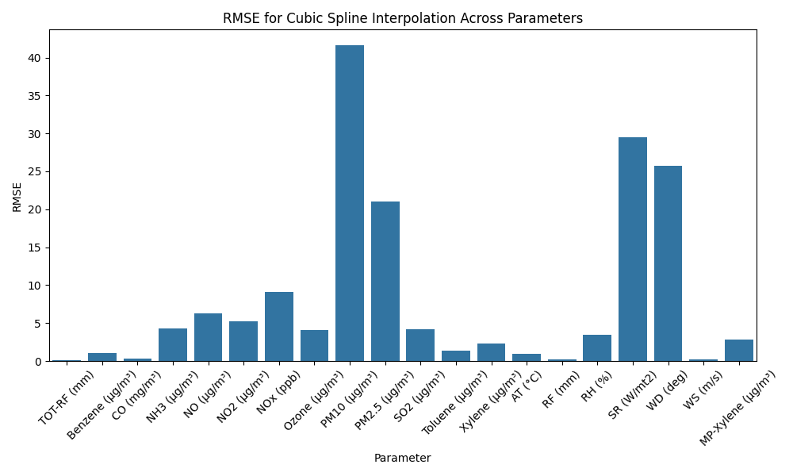
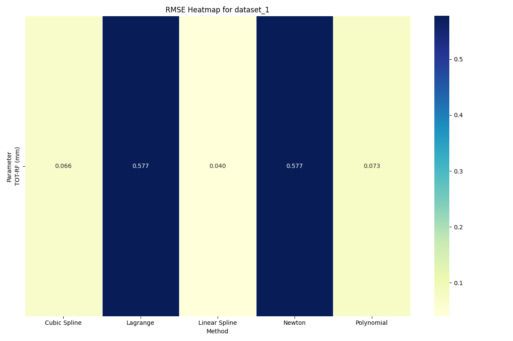
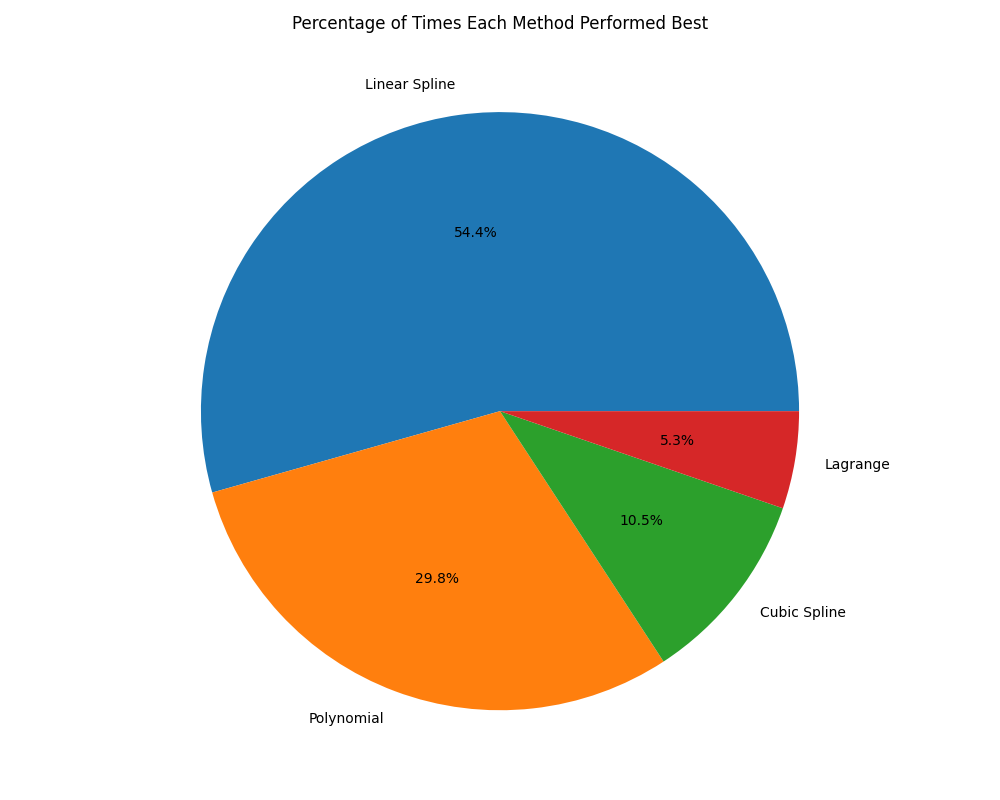
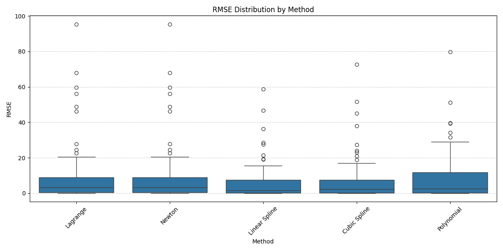

# Numerical Weather Interpolator

A comprehensive project for evaluating interpolation methods for missing weather data.

## Table of Contents
- [Overview](#overview)
- [Interpolation Methods](#interpolation-methods)
- [Error Metrics](#error-metrics)
- [Visualization Types](#visualization-types)
- [Interpreting Results](#interpreting-results)
- [Practical Recommendations](#practical-recommendations)

## Overview

This project evaluates multiple interpolation methods for predicting missing values in weather data across different parameters and datasets.

The analysis generates a comprehensive set of visualizations and metrics to help you determine which interpolation methods work best for different types of weather data.

## Interpolation Methods

The project evaluates the following interpolation methods:

| Method | Description | Best For |
|--------|-------------|----------|
| **Lagrange** | Constructs polynomial that passes through all data points | Small datasets with smooth patterns |
| **Newton** | Uses divided differences to create interpolating polynomial | Datasets with evenly spaced points |
| **Linear Spline** | Connects data points with straight lines | Data with sharp transitions |
| **Cubic Spline** | Uses cubic polynomials between data points with continuous derivatives | Smooth continuous data |
| **Polynomial** | Fits single polynomial of specified degree | Overall trends in smaller datasets |

## Error Metrics

The analysis uses several error metrics to evaluate the performance of each interpolation method:

- **RMSE (Root Mean Square Error)**: Measures the average magnitude of errors (lower is better)
- **MAE (Mean Absolute Error)**: Average absolute difference between predictions and actual values (lower is better)
- **MAPE (Mean Absolute Percentage Error)**: Percentage error relative to true values (lower is better)
- **R² (Coefficient of Determination)**: How well predictions match actual values (higher is better, max 1.0)
- **Max Error**: The maximum error observed (lower is better)

## Visualization Types

The analysis generates several types of visualizations, organized in different directories:

### 1. Per-Method Analysis (`results/per_method/`)

These visualizations show how each interpolation method performs across different parameters:

- **{method}_rmse_by_parameter.png**: Bar chart showing RMSE for each parameter using this method
- **{method}_rmse_distribution.png**: Box plot showing the distribution of RMSE values
- **{method}_summary.csv**: Detailed CSV with error metrics

**How to interpret**: Lower bars indicate better performance. Box plots show the variability of the method's performance - smaller boxes mean more consistent performance.

### 2. Per-Parameter Analysis (`results/per_parameter/`)

These visualizations focus on how different methods perform for specific parameters:

- **{parameter}_avg_rmse_by_method.png**: Line plot showing average RMSE by method
- **{parameter}_method_comparison.png**: Bar chart comparing methods
- **{parameter}_best_methods_pie.png**: Pie chart showing which methods perform best

**How to interpret**: Methods with lower values in the line and bar charts are better for that parameter. The pie chart shows which method most frequently achieves the best results.

### 3. Per-Dataset Analysis (`results/per_dataset/`)

These visualizations analyze each dataset separately:

- **{dataset}_heatmap.png**: Heatmap of RMSE values for all parameter-method combinations
- **{dataset}_{parameter}_method_ranking.png**: Ranking of methods for each parameter
- **{dataset}_summary.csv**: Detailed CSV with error metrics

**How to interpret**: In heatmaps, darker blue indicates better performance (lower RMSE). In ranking plots, methods with shorter bars are better.

### 4. Summary Analysis (`results/summary/`)

These visualizations provide an overall view of method performance:

- **average_rmse_by_method.png**: Average RMSE across all datasets and parameters
- **average_mae_by_method.png**: Average MAE across all datasets and parameters
- **average_r2_by_method.png**: Average R² across all datasets and parameters
- **best_method_counts.png**: Count of times each method performed best
- **best_method_percentage.png**: Percentage breakdown of best methods
- **method_ranking_report.txt**: Text summary of method rankings

**How to interpret**: Methods with lower RMSE/MAE values and higher R² values perform better overall. The count and percentage breakdowns show which methods most frequently achieve the best results.

### 5. Error Distribution Analysis (`results/error_distribution/`)

These visualizations show the distribution of errors:

- **{metric}_distribution.png**: Box plots showing error distribution by method
- **{method}_{metric}_by_parameter.png**: Error distributions for each method by parameter

**How to interpret**: Smaller boxes indicate more consistent performance. Lower median values (horizontal line in box) indicate better overall performance.

### 6. Example Visualizations (`results/examples/`)

These show actual examples of interpolation for specific parameters:

- **{parameter}_{method}_example.png**: Visual example of interpolation results
- **{parameter}_method_comparison_detail.png**: Detailed comparison of methods on same data segment

**How to interpret**: Compare the predicted values (red x's) with the true values (black circles) to visually assess accuracy. The closer they are, the better the interpolation.

## Interpreting Results

### Finding the Best Method for a Specific Parameter

1. Go to `results/per_parameter/`
2. Check the `{parameter}_method_comparison.png` file
3. The method with the lowest bar is generally the best choice
4. For more detail, check the `{parameter}_summary.csv` file

### Finding the Most Versatile Method Overall

1. Go to `results/summary/`
2. Check `average_rmse_by_method.png` and `best_method_percentage.png`
3. Methods with the lowest RMSE and highest percentage in the pie chart are the most versatile
4. For a text summary, read `method_ranking_report.txt`

### Checking Method Consistency

1. Go to `results/error_distribution/`
2. Check `rmse_distribution.png`
3. Methods with smaller boxes (less spread) are more consistent across different data types
4. Lower median values (horizontal line in box) indicate better overall performance

## Practical Recommendations

Based on typical results, here are some general recommendations:

1. **For highly variable data** (e.g., wind speed, precipitation):
   - Cubic Spline or Linear Spline typically perform better
   - Avoid high-degree polynomial methods which may overfit

2. **For smooth, gradually changing data** (e.g., temperature, pressure):
   - Cubic Spline typically offers the best results
   - Newton's method often performs well too

3. **For data with occasional sharp transitions**:
   - Linear Spline may outperform more complex methods
   - Lagrange polynomials often struggle with these datasets

4. **For datasets with very few points**:
   - Newton's method or low-degree polynomial interpolation usually works best
   - Cubic splines may overfit with very few points

5. **For real-time applications**:
   - Linear Spline is computationally efficient
   - Cubic Spline offers a good balance between accuracy and efficiency

Remember that the best approach is to check the specific analysis for your data and parameters, as performance can vary based on the unique characteristics of each dataset.

---

*Documentation created by [@gauravvjhaa](https://github.com/gauravvjhaa)*  
*Last updated: 2025-03-23*